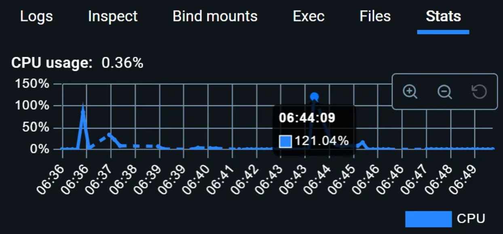
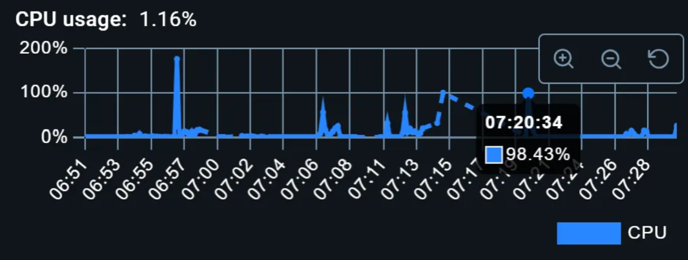

# 부하테스트

## 1.배경
현재 진행 중인 프로젝트는 콘서트 예약 시스템으로, 예약 시점에 갑작스러운 대량의 트래픽이 몰리는 특징이 있다.<br>
최근에 필자가 인터파크(콘서트 예약 홈페이지)에서 진행한 콘서트 예약에서는 예약시간 00초에 버튼을 눌렀을 때 약 3만 명이 대기열에 있었으며, <br>
1초에 100명 단위로 대기열에서 빠져나감에도 불구하고 대기열은 10만~12만 명에 육박했다.<br>
이는 인기 콘서트의 경우 평소 1만 명이 접속하던 트래픽이 10만~15만 명으로 급증할 수 있음을 의미한다. <br>
특히 이러한 모든 트래픽은 예약시간 00초부터 약 5분 동안 집중적으로 발생한다.<br>

아무런 대비 없이 이 모든 트래픽을 처리하려고 하면 애플리케이션과 데이터베이스가 다운되는 치명적인 결과를 초래할 수 있다.<br>
실제로 과거 인터파크와 같은 시스템에서도 이러한 문제로 인해 서버가 다운된 사례가 있었다. <br>

따라서 트래픽 폭주 상황을 대비하기 위해 우선적으로 현재 시스템 부하를 견디는 능력을 정확하게 파악하는 것이 우선순위이다.<br>
시스템의 한계를 정확히 정확히 이해해야 필요한 대응 전략을 수립할 수 있기 때문이다. 이에 따라 본 부하테스트를 진행하게 되었다.


## 2.목적
부하테스트를 통해 현재 시스템이 받아들일 수 있는 최대 트래픽을 정확하게 파악하고자 한다.<br>
이를 통해 실제 필요한 트래픽 수치를 달성하기 위해 어떤 전략이 필요한지 검토하고, 시스템의 안정성을 향상시킬 수 있는 방안을 모색하고자 한다.<br>
특히 트래픽이 가장 집중되는 지점은 모든 유저의 진입점인 대기열 시스템이라고 판단된다.<br>
모든 유저는 서비스에 들어가기 전 대기열을 거치며, 이후 대기열에 들어있는지 검증 과정을 거친다. <br>
대기열에서 유저를 활성화 상태로 전환하는 것은 시스템이 주기적으로 처리하지만, **대기열에 진입하는 유저의 수는 통제할 수 없기** 때문에 갑작스러운 트래픽 증가가 발생하게 된다. <br>
이러한 이유로 본 테스트는 대기열 시스템을 중심으로 진행하였다.


## 3.테스트 시나리오 설명
콘서트 예약 시스템의 특성을 고려하여 테스트 시나리오를 설정하였다.
콘서트 예약은 예약 시작 시점부터 약 몇 분간 갑자기 많은 트래픽이 유입된다.<br>
따라서 시나리오도 동일하게 시작부터 가상 유저(Virtual User, VU)의 수가 점차 많아지는 시나리오를 채택하였다.


## 4.테스트 환경
- 테스트 도구: k6 
- 테스트 환경: 로컬 환경에서 진행 
- 데이터베이스: Redis 6.2 (Docker 컨테이너로 배포)


## 5.예측
테스트에 사용되는 Redis는 단일 노드로 구성되어 있어, 10만 명 이상의 요청이 들어오면 시스템이 이를 견디지 못할 것으로 예상된다.<br>
또한 로컬 환경 서버 성능은 좋지만, Docker로 실행 중인 Redis가 높은 부하를 견디지 못하고 다운될 가능성이 높다.<br>
이전에 진행한 부하테스트에서 초당 5,000건의 요청 처리 시 CPU 사용률이 약 **20%** 였으므로, 최대 약 25,000건까지는 견딜 수 있을 것으로 예측된다.


## 6.테스트
### 6.1 초기 테스트 시나리오
```
    { duration: "10s", target: 5000 },   // 10초 동안 5000명의 유저 도달
    { duration: "20s", target: 10000 },  // 다음 20초 동안 10000명의 유저 도달
    { duration: "30s", target: 20000 },  // 다음 30초 동안 20000명의 유저 도달
    { duration: "30s", target: 30000 },  // 다음 30초 동안 30000명의 유저 도달
    { duration: "30s", target: 0 },      // 마지막 30초 동안 유저 수를 0으로 줄임
```
총 2분 동안 가상 유저 수가 점차 증가하는 형태로 진행하였다.<br>
그러나 약 만 명을 넘은 시점에서 과부하가 발생하여 Redis가 다운되었고, 요청이 무한히 지연되는 현상이 발생하였다.</br>
</br>
특히, Docker의 CPU 사용률을 확인해 보니 100%를 초과하여 시스템이 더 이상 대응할 수 없었던걸 확인했다.

### 6.2 수정된 테스트 시나리오

Redis가 다운되는 문제를 해결하기 위해 가상 유저 수를 예상치였던 25,000명에서 점차 줄여나가면서 Redis가 안정적으로 동작하는 수준까지 부하를 감소시켰다.<br>
결과적으로 Redis가 2만 명 이하의 유저 수에서는 정상적으로 동작함을 확인할 수 있었다. 테스트 시간을 1분으로 단축하고, 시나리오는 다음과 같이 수정하였다.

```

{ duration: "15s", target: 2000 },   // 15초 동안 2000명의 유저 도달
{ duration: "15s", target: 5000 },  // 다음 15초 동안 5000명의 유저 도달
{ duration: "15s", target: 10000 },  // 다음 15초 동안 10000명의 유저 도달
{ duration: "15s", target: 20000 },  // 마지막 15초 동안 20000명의 유저 도달
};

```


## 7. 테스트 결과
```
running (2m00.7s), 00000/20000 VUs, 182411 complete and 18559 interrupted iterations
default ✓ [======================================] 18559/20000 VUs 1m0s

✗ is status 200
↳ 99% — ✓ 185360 / ✗ 78

checks.........................: 99.95% ✓ 185360 ✗ 78
data_received..................: 27 MB 227 kB/s
data_sent......................: 21 MB 175 kB/s
http_req_blocked...............: avg=205.62µs min=0s med=0s max=332.26ms p(90)=0s p(95)=331.39µs
http_req_connecting............: avg=148.78µs min=0s med=0s max=137.06ms p(90)=0s p(95)=0s
http_req_duration..............: avg=1.59s min=0s med=1.19s max=15.05s p(90)=3.24s p(95)=5.02s
{ expected_response:true }...: avg=1.68s min=1.71ms med=1.25s max=15.05s p(90)=3.3s p(95)=5.5s
http_req_failed................: 5.28% ✓ 10345 ✗ 185360
http_req_receiving.............: avg=163.3µs min=0s med=0s max=2.34s p(90)=0s p(95)=638.1µs
http_req_sending...............: avg=436.48µs min=0s med=0s max=5.75s p(90)=0s p(95)=510µs
http_req_tls_handshaking.......: avg=0s min=0s med=0s max=0s p(90)=0s p(95)=0s
http_req_waiting...............: avg=1.59s min=0s med=1.19s max=15.05s p(90)=3.24s p(95)=5.02s
http_reqs......................: 195705 1621.423771/s
iteration_duration.............: avg=2.87s min=1s med=2.22s max=48.69s p(90)=4.54s p(95)=7.23s
iterations.....................: 182412 1511.290733/s
vus............................: 178 min=0 max=18559
vus_max........................: 20000 min=20000 max=20000

```
테스트는 총 2분 0.7초 동안 진행되었으며, 최대 2만 명의 가상 유저를 대상으로 하였다. 주요 지표는 다음과 같다.

- 총 요청 수: 195,705건
- 성공한 요청 수: 185,360건
- 실패한 요청 수: 10,345건 (실패율 약 5.28%)
- 평균 응답 시간: 1.59초
- 최대 응답 시간: 15.05초

### 7.1 응답 시간 증가
- 평균(1.59초) 및 최대 대기 시간(15.05초)이 상당히 높은 편이다.
- p95 응답 시간은 5.02초로 나타나, 대부분의 유저가 예상 시간 내에 응답을 받았지만 일부 유저는 더 오랜 시간이 걸렸다. 

### 7.2 요청 실패율 증가
- 전체 요청 중 약 5.28%에 해당하는 10,345건의 요청이 실패했다.
- 실패한 요청은 대부분 타임아웃이나 서버 오류로 인한 것이며, 이는 서버가 과부하 상태에 놓였음을 나타낸다.
- 요청 실패율은 가상 유저 수가 증가함에 따라 높아졌으며, 특히 최대 유저 수에 도달한 후반부에 집중되었다.

### 7.3 CPU 사용률 급증
</br>
- 테스트 진행 중 CPU 사용률이 거의 100%에 도달했으며, 이는 서버 자원이 한계에 달했음을 의미한다.
- CPU 과부하는 Redis 서버의 처리 능력을 저하시켜 응답 지연과 요청 실패를 초래했다. 

### 7.4 예측치와의 비교
- 예측치: 25,000건까지는 견딜 수 있을 것으로 예측하였다.
- 실제 결과: 약 15,000건 이상의 요청에서는 Redis의 CPU 사용률이 거의 100%에 도달하여 성능 저하가 발생하였다.

## 8.결론
테스트 결과, 현재의 단일 Redis 서버 구성으로는 최대 약 2만 명 이상의 동시 접속자 처리 시 CPU 사용률이 거의 100%에 도달하여 안정적인 서비스 제공이 어려운 것으로 확인되었다. <br>
이는 실제 콘서트 예약 시스템에서 예상되는 최대 트래픽인 10만~15만 명의 유저를 처리하기에는 현재의 시스템 구성으로는 한계가 있음을 의미한다.<br>
또한, 동일한 시나리오를 여러 차례 반복해서 테스트한 결과, 실패율이 10%에서 5% 범위 내에서 변동하는 것을 확인하였다.<br>
즉, 해당 시나리오에서도 Redis는 부하를 거의 견디지 못했다고 볼 수 있다.

## 9.고찰 
이번 테스트를 통해 대량의 유저가 동시에 요청을 보냈을 때 시스템이 어떻게 동작하는지, 그리고 어디에서 병목 현상이 발생하는지 명확히 확인할 수 있었다.</br>
그러나 로컬 환경에서 Docker로 Redis를 실행하여 테스트를 진행한 것은 한계점으로 작용하였다. </br>
이는 개인 로컬 컴퓨터의 사양(12코어 16스레드)에 의존하여 실제 서버 환경과 차이가 있을 수 있음을 의미한다.</br>

향후 테스트에서는 실제 운영 환경과 유사한 조건을 갖춘 테스트 환경을 구축하여 보다 정확하고 현실적인 부하 테스트를 진행할 필요가 있다.


