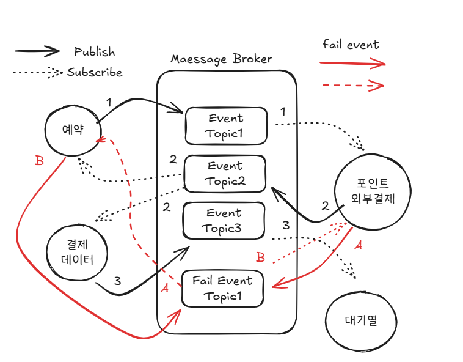
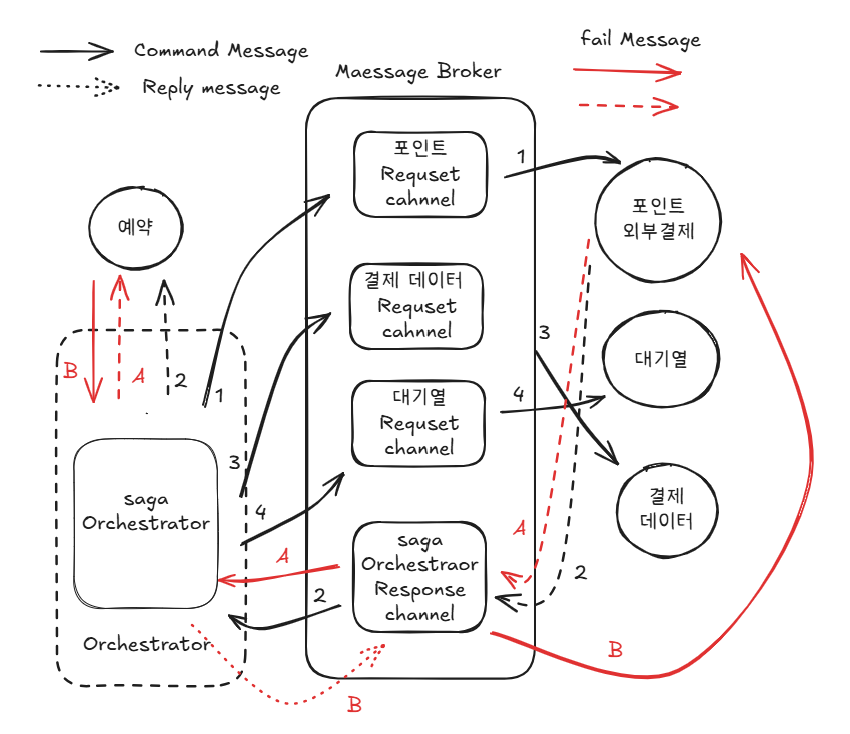

# MSA로 변경시 나오는 트랜잭션 처리의 한계와 해결방안 보고서

### 개요
서비스 규모가 확장되어 모놀리티 아키텍처에서 마이크로 서비스 아키텍처 MSA 로 전환하려고 한다.<br>
각 도메인 별로 배포 단위를 분리해야한다면 그 분리에 따른 트랜잭션 처리의 한계와 해결방안을 제시해보려 한다. 

## 트랜잭션의 개념과 성질

### 트랜잭션이란 ? 
트랜잭션이 뭘까?
- 일이 처리되기 위핸 가장 작은 단위이다.

예로 , 내가 B라는 대상자에게 10,000원을 계좌이체 한다고 하자.
1. 내 통장의 잔액 10,000원 감소
2. B 통장의 잔액 10,000원 증가

→ 1.인출과 2.입금이라는 두 과정이 있다. <br>
→ 1.인출만되고, 2.입금은 실패하면 치명적인 결과가 나온다.<br>

- 이 두 과정은 동시에 성공하던지 동시에 실패해야한다.
- 이 두 과정을 동시에 묶는 방법이 트랜잭션이다.

즉 이것을 데이터 베이스와 어플리케이션의 데이터 거래 에 있어서 안정석을 확보하기 위한 방법이 트랜잭션이다.<br>
→ 따라서 데이터베이스에서 테이블을 읽어 온 후 다른 테이에 데이터를 입력하거나 갱신, 삭제하는 도중에 오류가 발생하면 결과를 재반영 하는 것이 아닌 모든 작업을 원상태로 복구하고, 처리 과정이 모두 성공하였을 때 만 그 결과를 반영한다.


### 트랜잭션의 성질 ACID
- Atomicity(원자성)
  - 더 이상 쪼개질 수 없는 단위.
  - 모두 성공하거나, 모두 실패해야한다.
- Consistency(일관성)
  - Transaction 전후로 데이터가 일정해야함
  - 트랜잭션 실행 전 후에 데이터베이스는 항상 유호한 상태를 유지해야한다.
  - 데이터베이스가 판단하기는 어렵고 어플리케이션 단에서 관리해야한다.
  - ex) 마지막 한 개 남은 상품을 동시에 2명의 고객이 주문할 수 없도록
- Isolation(격리)
  - 동시에 발생하는 transaction이 서로의 영향을 받지 않도록 격리되어야 한다.
- Durability(지속성)
  - Commit 된 transaction은 시스템 오류가 발생하더라도 변경 사항이 손실되지 않는다.

--- 

# 콘서트 예약 시스템의 MSA 

### 기존 모놀리틱 트랜잭션 코드 분석 
현재 콘서트 예약 시스템은  facade 레어이에서 여러 서비스를 하나의 트랜잭션으로 처리하고 있다. </br> 
MSA로 변경할 경우 이 트랜잭션이 각각의 서비스로 분리되어야만 한다. </br>

```java
    @Transactional
    public PaymentReservationInfo completeReservation(Long userId, Long ConcertScheduleId, Long seatId, Long ReservationId, String paymentData) {

        User user = userQueryService.getUserById(userId);
        ConcertSchedule concertSchedule = concertQueryService.getConcertSchedule(ConcertScheduleId);
        Seat seat = concertQueryService.getSeat(seatId);

        Reservation reservation = reservationCommandService.findByLock(ReservationId); 

        reservation.validateReservation(user.getId(), seat.getId());
        PaySystem.pay(seat.getPrice()); // 또는 내부 Point 결제 로직

        reservation.book();
        Payment payment = paymentCommandService.savePayment(user.getId(), reservation.getId(), seat.getPrice(), PaymentStatus.SUCCESS);
        
        //대기열 만료 로직 
        
        return new PaymentReservationInfo(concertSchedule.getId(),user.getId(), seat.getId(), payment.getId(), payment.getAmount());
    }
```

문제점 : 다수의 서비스 작업이 하나의 트랜잭션으로 묶여 있다.
 - 사용자 조회 (사용자 서비스)
 - 콘서트 스케줄 조회 (콘서트 서비스)
 - 콘서트 좌석 조회 (콘서트 서비스)
 - 예약 조회 + 락 (예약 서비스)
 - 외부 시스템인 결제 모듈 연결 또는 내부 포인트 결제 로직 (유저 서비스, 외부 도메인)
 - 예약 데이터 변경 (예약 서비스)
 - 결제 완료 데이터 생성 (결제 완료 서비스?)
 - 대기열 만료

MSA을 제외 하더라도 이렇게 많은 작업이 모여있을 경우 문제가 발생할 수 있다. 
1. 트랜잭션 안에서 이루어진 데드락, 타임아웃등이 발생할 수 있음.
2. 외부와의 통신(PaySystem) 으로 인해 트랜잭션이 오래 유지될 수 있음.
3. 하나의 작업 실패가 전체 트랜잭션을 롤백하게 됨. 
   - ex) 대기열 만료의 경우, 실패해도 괜찮은 로직임. 그런데 마지막 트랜잭션으로 해당이 실패할 경우 앞에 모든 트랜잭션이 rollback 


### 트랜잭션 분할 
서비스 분리 설계 
```java
   예약_생성_TX1() {
      예약_정보_생성();
   }
   결제_처리_TX2() {
      포인트_차감_처리();
      또는_외부_결제_처리();
   }
   예약_완료_TX3() {
      예약_조회();
      예약_완료로_변경();
   }
   결제_저장_TX4() {
      결재_데이터_저장();
   }
   대기열_만료_TX5() {
      대기열_만료();
   }

```
이렇게 분리해볼 수 있을 것 같다. 
트랜잭션을 분리함으로서 위에서 제시한 문제들을 해결할 수 있을 것으로 보인다. 


## 트랜잭션 분할시 발생하는 문제점
### 트랜잭션과 락
기존 로직은 예약을 생성하고 선점하여 락을 잡는다. 그 이후 결제가 완료되면 예약의 데이터를 완료로 변경한다. <br>
MSA로 변경하면, TX1에 대란 락은 어떻게하지?

```java
   예약_생성_TX1() {
       //락 범위 
   }
   결제_처리_TX2() {
       //락 없어요!! 
   }
```
- 락은 트랜잭션 범위 내애서만 유효하다. 따라서 tx1이 끝나면 그 안에 있던 락도 해제된다.
- 따라서 Tx1() 에서 획득한 락을 Tx2() 에서도 유지할 수 없다. 

즉, 내가 의도한 로직 예약 - 결제 동시성 문제를 해결하기 위해 부여한 락이 의미가 없어졌다. 

### 결제가 실패한다면?
결제를 실패할 경우 어떻게 하지? 결제를 완료했는데, 예약이 변경되어서 예약 완료를 할 수 없다면 어떻게 하지?? <br> 
=> 즉, 트랜잭션의 분리로 인해 전체 트랜잭션의 원자성을 보장할 수 없게 되었다.  <br> 

<br>

**" 이러한 트랜잭션의 분할로 가져온 문제를 어떻게 해결해야할까? "**

---
   
# 해결방안

## SAGA 패턴
- 트랜잭션 분리로 인해 발생하는 데이터 일관성을 보장하기 위해 SAGA 패턴을 적용해보자.
- SAGA 패턴에서는 연속된 개별 서비스의 로컬 트랜잭션이 이어져, 전체 비즈니스 트랜잭션을 구성한다.
- 첫번째 트랜잭션이 완료되면 두번째 트랜잭션이 트리거 되고, 두번째 트랜잭션이 완료되면 세번째 트랜잭션이 트리거된다 (이 과정이 마치 하나의 무용담(saga)같아 SAGA라는 이름이 붙여졌다).
- SAGA 패턴에서는 개별 서비스가 실패했을 때 보상 트랜잭션(compensating transaction)을 발생시켜 이를 상쇄한다.

SAGA 패턴은 크게 코레오그래피 기반 사가와 오케스트레이션 기반 사가로 구분된다.


### 코레오그래피 기반 사가 (Choreography-based Saga)
- 각 서비스는 트랜잭션이 완료되면, 완료 이벤트를 발행한다. 
- 만일 그 다음에 수행되어야할 로컬 트랜잭션이 있다면, 해당 이벤트를 구독한 마이크로 서비스가 이어서 실행한다. 
- 중간에 로컬 트랜잭션이 실패하면, 이에 대한 보상 트랜잭션 이벤트를 발생하여 롤백을 시도한다.

- 장점
  - 구성이 편리하다. (왜? 서로 다른 서비스에 대해 몰라도 돼서)
  - 하나의 서비스에 문제가 발생해도, 시스템 나머지 부분이 영향을 덜 받는다.

- 단점
  - SAGA 참가자가 많은 경우 트랜잭션 흐름이 복잡하다.
  - 마이크로 서비스간 순환 종속성이 발생할 수 있다.
  - 각 마이크로 서비스가 서로를 알고 있는 구조로, 결합도가 높다.



### 오케스트레이션 기반 사가 (Orchestration-based Saga)
- 중앙 집중된 Saga Orchestrator가 SAGA 참여자들에게 어떤 로컬 트랜잭션을 실행해야하는지 알려주는 방식이다. 
- 오케스트레이터가 모든 트랜잭션을 처리하고, 필요하다면 보상 트랜잭션을 발생시켜 롤백을 시도한다.

- 장점
  - 트랜잭션을 모두 오케스트레이터가 관리하여, 트랜잭션 흐름이 명확하다.
  - 각 마이크로 서비스는 서로를 알지 못하여, 결합도가 낮다.

- 단점
  - 오케스트레이터에 중앙 집중되어 단일장애지점(SOPF)가 될 수 있다.
  - 같은 이유로 확장성과 유연성이 낮다.



### SAGA 패턴 적용 
- 왜 결제 실패시에는 보상트랜잭션을 사용하지 않았나?
  - 결제 데이터가 실패했다고 해서 예약과 포인트 결제가 취소 되어야 할까?
    - 결제 데이터 저장은 예약과 결제가 완료된 후 데이터가 저장되는 것에 불과함.
  - 즉, 이것 때문에 전에 이전 트랜잭션이 롤백 될 이유가 없음. 따라서 결제 데이터 저장이 실패시에는 결제 서비스 내부에서 재시도 로직을 돈다. 
  - 여러번 실패시 테이블에 담거나, 에러 로그를 발행하는게 좋을 것 같다.


---

참고 자료 : 
- 내 블로그  https://sugasalt.tistory.com/26
- https://hudi.blog/saga-pattern/ 