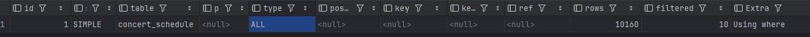
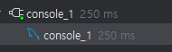
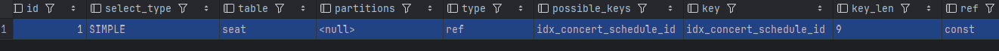
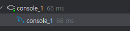
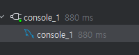
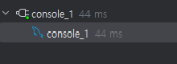

# 인덱스 적용을 통한 쿼리 성능 개선 및 분석

## 목차
* [1. 인덱스](#1-인덱스)
   + [1.1 인덱스란?](#11-인덱스란)
   + [1.2 인덱스의 동작 방식](#12-인덱스의-동작-방식)
   + [1.3 인덱스를 설정할 기준](#13-인덱스를-설정할-기준)
   + [1.4 카디널리티(Cardinality)와 인덱스 효과](#14-카디널리티cardinality와-인덱스-효과)
   + [1.5 무조건 카디널리티가 높은게 좋을까?](#15-무조건-카디널리티가-높은게-좋을까)
   + [1.6 인덱스를 많이 설정하면 좋을까?](#16-인덱스를-많이-설정하면-좋을까)
* [2. 서비스 주요 조회 쿼리 분석](#2-서비스-주요-조회-쿼리-분석)
   + [2.1 테스트 데이터](#21-테스트-데이터)
   + [2.2 주요 쿼리 및 성능 측정](#22-주요-쿼리-및-성능-측정)
* [결론](#결론)
* [차후 고려해볼 사항](#차후-고려해볼-사항)


## 1.인덱스 
### 1.1 인덱스란?
인덱스(index)는 데이터베이스에서 검색 성능을 높이기 위해 사용되는 자료구조이다. 
인덱스는 책의 목차처럼, 특정 열(column)의 값을 기준으로 데이터를 빠르게 찾을 수 있도록 도와준다. 
인덱스가 없을 경우, 데이터베이스는 풀 스캔(full scan)을 수행하게 되며, 이는 테이블의 모든 데이터를 읽어야 하기 때문에 비효율적이다.

### 1.2 인덱스의 동작 방식
인덱스는 키-값 쌍(key-value pair) 구조로 되어 있으며, 다음과 같은 동작 방식을 가진다.
- 정렬된 상태 유지 : 인덱스는 항상 정렬된 상태로 유지되며, 검색 시 이진 탐색이 가능해 빠른 조회가 가능하다.
- 동시 업데이트 : 데이터를 삽입하거나 삭제할 때, 인덱스도 함께 업데이트된다.
- 자료구조 활용 : 인덱스는 일반적으로 B-Tree, B+Tree, Hash Table 등의 자료구조를 사용하여 구현된다.

예를 들어, SELECT * FROM users WHERE age = 30 쿼리를 실행할 때, age 열에 인덱스가 있다면 데이터베이스는 인덱스를 통해 해당 값의 위치를 빠르게 찾을 수 있다.

### 1.3 인덱스를 설정할 기준

인덱스를 설정할 때는 다음과 같은 기준을 고려해야 한다 :
- 자주 검색되는 열: WHERE, JOIN, ORDER BY, GROUP BY에서 자주 사용되는 열에 인덱스를 설정
- 카디널리티(Cardinality): 열의 고유한 값의 수가 많은 경우 인덱스의 효과가 더 높다.
- 테이블의 크기: 작은 테이블에서는 인덱스의 이점이 크지 않으므로, 큰 테이블에 우선적으로 인덱스를 설정한다.
- 데이터 수정 빈도: 자주 수정되는 열은 인덱스 업데이트 비용이 크므로 신중하게 고려해야한다.

### 1.4 카디널리티(Cardinality)
**카디널리티(Cardinality)**는 컬럼에서 나타날 수 있는 서로 다른 값의 수를 의미한다.
즉, 서로 다른 데이터가 얼마나 많냐이다.
- 높은 카디널리티: 다양한 값 존재 (예: 주민등록번호)
- 낮은 카디널리티: 중복된 값 많음 (예: 성별)

### 1.4.1 카디널리티와 인덱스 효율성
높은 카디널리티 컬럼에 인덱스를 설정하면 검색 효율이 높아진다.
반대로, 카디널리티가 낮은 컬럼은 인덱스의 효과가 적어진다.
- 카디널리티 확인 방법 : MYSQL
```SQL
  SHOW INDEX FROM 테이블명;
```
-> Cardinality 컬럼을 통해 확인 가능하다. 

### 1.5 무조건 카디널리티가 높은게 좋을까? 
그렇다면 index를 지정할 때 무조건 카디널리터가 높은걸로 지정하면 좋겠네? 
=> 카디널리티가 낮은 경우로 지정하는 경우도 존재한다. 

```sql
   select x
   from users
   group by y, z;
```
1. 이러한 쿼리가 있을때 y의 카디널리티가 매우 높으면, 좋을까?
   - 이런 경우 y의 카디널리티가 높으면 그 보다 낮은 z의 경우 index의 의미가 없어진다. 
   - 왜? 이미 y에서 데이터가 다 필터링 됐는데 z가 필요할까?

2. GROUP BY 할 때 묶어주는데 카디널리티가 매우 높으면 좋을까?
   - 분류하는데 1000개가 있어서 1000개로 나누면 그게 그룹핑의 의미가 없어진다. 
   - 즉, 중복도가 높을 수록 그룹핑 할 때는 오히려 의미가 있다(낮은 카디널리티)

3. ORDER BY 할 때 정렬하는 카디널리티가 매우 높으면 좋을까?
   - 정렬해야하는 대상은 적을 수록 좋다. 
   - 즉, 정렬시에도 낮은 카디널리티가 유리하다. 

카디널리티가 높은게 무조건 index 설정에 유리한 것은 아니며, index 설정할 때는 카디널리티 이외에도 다양한 조건을 확인 할 필요가 있다.

### 1.6 인덱스를 많이 설정하면 좋을까?
인덱스를 너무 많이 설정하면 오히려 성능이 저하될 수 있다.

- 쓰기 성능 저하: 인덱스는 삽입, 삭제, 수정 시마다 업데이트되므로 쓰기 작업이 느려질 수 있다..
- 공간 낭비: 인덱스는 별도의 저장 공간을 사용하므로, 많은 인덱스를 설정하면 스토리지 사용량이 증가한다.
- 복잡한 실행 계획: 너무 많은 인덱스는 데이터베이스가 적절한 인덱스를 선택하기 어렵게 만들어 실행 계획이 복잡해질 수 있다.

따라서, 인덱스는 필요한 열에 한정하여 신중하게 설정해야한다.


### 1.6.1 적절한 인덱스 설정
- 필요한 경우에만 설정: 자주 조회되는 컬럼에 한정하여 인덱스 설정
- 정규화와의 균형: 데이터 모델링 단계에서 인덱스 활용을 고려
- 쿼리 최적화와 병행: 인덱스뿐만 아니라 쿼리 자체의 효율성도 중요

## 2.서비스 주요 조회 쿼리 분석

### 2.1 테스트 데이터 
1. concert_schedule 1,000,000 개
=> 1만개 설정 하였으나, 인덱스가 제대로 동작하지 않아 백만개로 변경. 

2. seat 100,000 ~ 1,000,000 개 

- 테스트의 정확성을 위해 redis 와 AuthorizationHeader 유저 체크를 제외하고 실행 
- DB의 버퍼 풀 캐싱을 방지하기 위해 id 값을 매번 다른 값으로 조회하여 확인

### 2.2 주요 쿼리 및 성능 측정
현재 조회 쿼리이다.
1. 콘서트 일정 조회
2. 좌석 조회
3. 포인트 내역 조회

### 2.2.1 concert_schedule 테이블 조회

```sql
EXPLAIN SELECT * FROM concert_schedule where concert_id = ?;
```
- 인덱스 미적용시 성능
  - 
  - 전체 테이블을 스캔하여 데이터 양이 많아질수록 쿼리 시간 증가. 
  - API 응답 시간: 약 1.10 초 
  - 쿼리 실행 계획에서 full table scan으로 나타남
  - 조회 성능 : 250ms
  -    

- 인덱스 적용시 성능 
  - 인덱스를 사용하여 concert_id로 데이터를 빠르게 조회
  - API 응답 시간: 약 0.70초
  - 조회 성능 : 108ms
  - 

- 결과 : **두 배 이상의 성능 차이**

### 테스트 중 발견사항
- 처음에 넣었던 10,000건 정도로는 그렇게 성능차이가 있진 않았음
- 10,000건 정도에서도 index 적용 후 60~70ms 정도라면, 플 스캔도 70~80ms 으로 극명한 차이가 나지 않음.
- 1,000,000건으로 더미 데이터를 수정함.

### 2.2.2 seat 테이블 조회

```sql
EXPLAIN SELECT * FROM seat where concert_schedule_id = ?;
```
- 인덱스 미적용시 성능
   - 
   - 전체 테이블을 스캔하여 데이터 양이 많아질수록 쿼리 시간 증가.
   - 쿼리 실행 계획에서 full table scan으로 나타남
   - 조회 성능 : 115ms
   - 

- 인덱스 적용시 성능
  - 
  - 인덱스를 사용하여 concert_schedule_id 데이터를 빠르게 조회
  - 조회 성능 : 66ms
  - 

- 결과 : **100,000건에서도 두 배 이상의 성능 차이**

### 테스트 중 발견사항 
- concert_schedule 에 비해 seat 테이블은 100,000 건에서도 index 도입으로 인한 성능차이가 두드러짐
- 1,000,000건으로 더미 데이터를 수정함.
  - 인덱스 미적용시 성능 : 880ms
  - 
  - 인덱스 적용시 성능 : 44ms
  - 

### 2.2.3 point 테이블 조회
- point의 경우 user_id를 연관관계로 설정했음.
- 따라서 FK인 user_id가 index로 이미 설정되어 있음.

=> FK는 JOIN 조건절 이므로, JOIN 조건의 컬럼에 인덱스가 걸려있으면 당연히 유리하다.
따라서, 현재 직접적으로 연관관계를 맺어 둔 테이블은 point 하나뿐이지만, 명시적으로 걸어둔 테이블도 FK로 조인한다면 index를 거는게 좋을 것 같다.

## 3.2 데이터 분포와 인덱스 효용성
왜, concert_schedule는 1,000,000건 이상 가야 차이가 보이고,
seat에서는 100,000 부터 index 효과가 보이는 걸까? </br>

  **" where 절에는 무조건 카디널리티가 높은게 더 빠른거 아닌가? "**

인덱스에는 카디널리티 외에도 영향을 받 수치들이 있다.
- 데이블의 전체 레코드수
- 인덱스 크기와 구조 
- 데이터 분포 및 클러스터링

각각 데이터 특성은 이렇다. 

- concert_schedule 테이블:
  - 높은 카디널리티: concert_id가 고유한 값
  - 데이터가 고르게 분포되어 있어 인덱스의 선택도가 높음
  - 데이터량이 많아질수록 인덱스의 효과 증대
- seat 테이블:
  - 낮은 카디널리티: 특정 concert_schedule_id에 다수의 seat가 존재
  - 데이터가 불균등하게 분포되어 있음
  - 데이터량이 적더라도 인덱스의 효과가 명확히 나타남

1. concert_schedule 는 인덱스의 크기가 백 만개고, seat 의 경우 만 개에 데이터가 고루 분포되어있다. 즉 인덱스 숫자가 차이가 난다. 
2. 인덱스는 b+ tree 구조를 사용하고 있기 떄문에 concert_schedule_id 를 기준으로 저장되어 있을 것이다. 
3. 이를 인덱스를 통해 조회할 때 디스크에 연속된 영역을 읽게 되기 때문에 효율이 높아진다. (클러스터링 효과)

이러한 이유로 concert_schedule_id에 100,000건 부터 INDEX 효과가 나타난게 아닌가 추측이 된다. 
즉, index는 같은 데이터 숫자라도 인덱스의 크기와 구조, 데이터 분포 등 에 따라서 계속해서 인덱스의 효용이 변경된다. 


## 결론
- concert_schedule 의 경우 
  - where 조건인 concert_Id를 인덱스 적용
  ```sql
   ALTER TABLE concert_schedule
    ADD INDEX idx_concert_id (concert_id);
  ```
- seat 의 경우
  - where 조건인 concert_schedule_Id를 인덱스 적용
  ```sql
   ALTER TABLE seat
    ADD INDEX idx_concert_schedule_id (concert_schedule_id);
   ```

### 차후 고려해볼 사항
index의 경우 최소한으로 잡고, 이후에 모니터링을 통해 느린 쿼리가 있다면 인덱스를 추가해 나가는 게 바람직하다.
또한 위에서 확인했듯이 데이터 크기나, 분포에 따라 index가 효과가 좋을 수도 나쁠 수 도 있다. 그렇기 때문에 지속적인 모니터링을 통해 index를 개선해 나가야한다. 

--- 
### 참고자료
 - 내 블로그 https://sugasalt.tistory.com/19